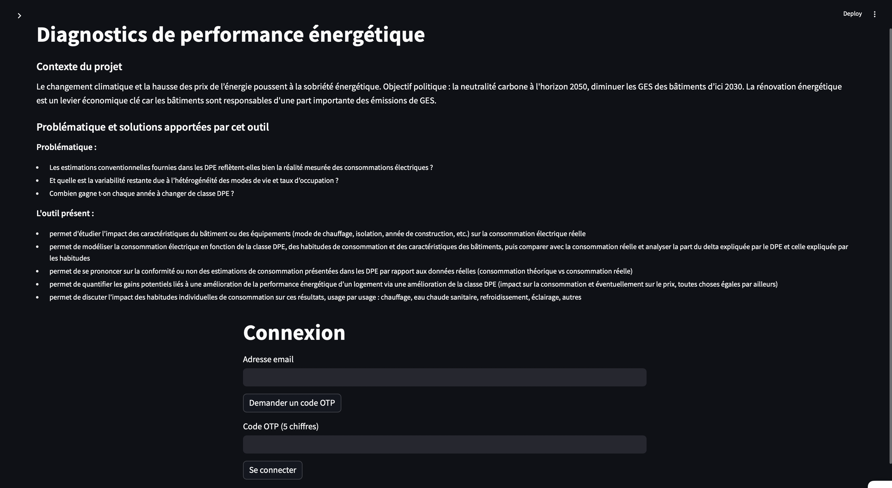
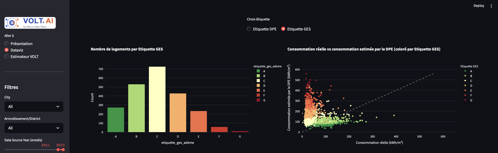
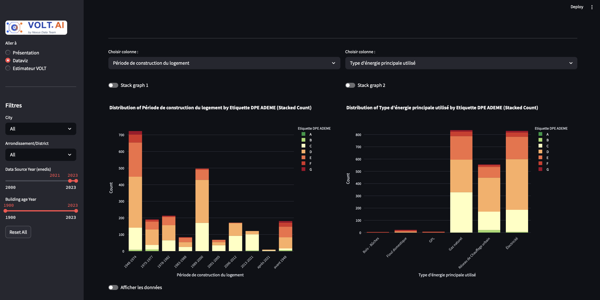

## DPE-Energy-Performance-Analysis-ClientApp

Outil de datavisualisation pour le projet DPE-Energy-Performance-Analysis. Encapsule le dashboard analytique et le model.


### ✅ Pré-requis

- Python 3.12 🐍
- Docker (recommandé)

### ⚙️ Config 

- Définir les variables d'environnement : 

```bash
SERVER_API_URL = "http://host:port"
S3_URL = "host:port" 
S3_ACCESS_KEY = "XXXXXXXX"
S3_SECRET_KEY = "XXXXXXXX"
S3_BUCKET_NAME = "dpe-storage-v1"
```

Les informations de connexion avec un stockage type s3/minio distant ne sont pas obligatoire si les logs de prédictions ne sont pas sauvagardés.

### ⚡️Utilisation en local

- Cloner ce repos
- Installer les requirements avec `pip install -r requirements.txt`
- Exécuter `streamlit run app.py`

### ➡️ Utilisation avec le conteneur (docker compose recommandé)

- Utilisez la commande docker run. Si le reste de la stack est déployée en local la commande suivante devrait être suufisante sinon, définir avec les urls en remote. 

```bash
docker run -it -d\
    -p 8501:8501 \
    -e SERVER_API_URL="http://host.docker.internal:<port>" \
    -e S3_URL="host.docker.internal:<port>" \
    -e S3_ACCESS_KEY="s3-access-key" \
    -e S3_SECRET_KEY="s3-secret-key" \
    fereol023/dpe-energy-performance-analysis-clientapp:<release_tag>
```
- Utilisez docker compose ([ici](docker-compose.yml)) en redéfinissant dans le docker-compose.yml les variables d'environnement.

- Pour avoir le dernier release tag, consulter la page [dockerhub de ce repos](https://hub.docker.com/repository/docker/fereol023/dpe-energy-performance-analysis-clientapp/general)

### 📃 Documentation 

La documentation et le guide utilisateur sont présents 

### 📊 Aperçus







### ℹ️ Contact(s)
- E-mail : fereol.gbenou@ynov.com
- Page pro : [LinkedIn](https://www.linkedin.com/in/fereol-gbenou/)
